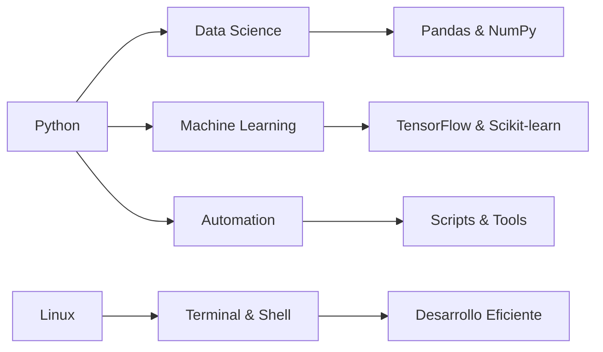

<div align="center">
  
</div>
<div align="center">
  
</div>
<br>
<div align="center">
  
</div>

---

## 🌟 Sobre Mí


```python
class Dopa:
    def __init__(self):
        self.username = "dopa"
        self.role = "Estudiante & Desarrollador en Crecimiento"
        self.location = "🌍 Aprendiendo desde cualquier lugar"
        self.interests = [
            "Inteligencia Artificial 🤖",
            "Análisis de Datos 📊",
            "Python Development 🐍",
            "Linux & Open Source 🐧"
        ]
        
    def say_hi(self):
        print("¡Gracias por visitar mi perfil!")
        print("Siempre listo para colaborar y aprender 🚀")

me = Dopa()
me.say_hi()
```

<br clear="right"/>

---

## 🔥 Mi Stack Tecnológico

<div align="center">

### Lenguajes


### Herramientas & Tecnologías


### Aprendiendo Actualmente


</div>

---

## 📊 Mis Estadísticas de GitHub

<div align="center">
  
  
</div>

<div align="center">
  
</div>

---

## 🎯 Objetivos 2026

<table align="center">
  <tr>
    <td align="center" width="25%">
      <br>
      <b>Contribuir a</b><br>
      <sub>proyectos open source</sub>
    </td>
    <td align="center" width="25%">
      <br>
      <b>Dominar</b><br>
      <sub>Machine Learning</sub>
    </td>
    <td align="center" width="25%">
      <br>
      <b>Construir</b><br>
      <sub>proyectos increíbles</sub>
    </td>
    <td align="center" width="25%">
      <br>
      <b>Colaborar</b><br>
      <sub>con la comunidad</sub>
    </td>
  </tr>
</table>

---

## 💡 Lo que estoy explorando



---

## 🤝 ¡Conectemos!

<div align="center">
  
  [](TU_LINKEDIN)
  [](TU_TWITTER)
  [](mailto:TU_EMAIL)
  
</div>

<div align="center">
  <br>
  <p><b>🌱 "El código es poesía, y cada día escribo un nuevo verso"</b></p>
  <br>
  
  
  
</div>

---

<div align="center">
  
</div>

<div align="center">
  
</div>
