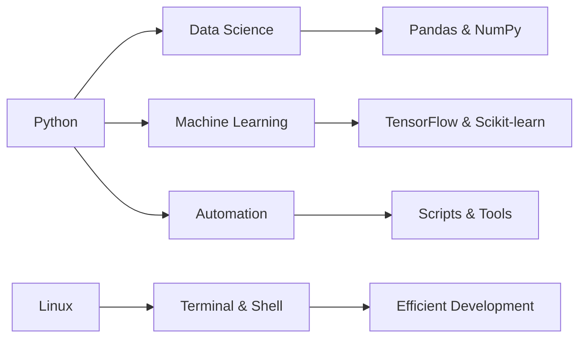

<div align="center">
  
</div>

<div align="center">
  
</div>

<br>

<div align="center">
  
</div>

---

## 🌟 About Me


```python
class Dopa:
    def __init__(self):
        self.username = "dopa"
        self.role = "Student & Growing Developer"
        self.location = "🌍 Learning from anywhere"
        self.interests = [
            "Artificial Intelligence 🤖",
            "Data Analysis 📊",
            "Python Development 🐍",
            "Linux & Open Source 🐧"
        ]
        
    def say_hi(self):
        print("Thanks for visiting my profile!")
        print("Always ready to collaborate and learn 🚀")

me = Dopa()
me.say_hi()
```

<br clear="right"/>

---

## 🔥 Tech Stack

<div align="center">

### Languages


### Tools & Technologies


### Currently Learning


</div>

---

## 📊 GitHub Stats

<div align="center">
  
  
</div>

<div align="center">
  
</div>

---

## 🎯 2026 Goals

<table align="center">
  <tr>
    <td align="center" width="25%">
      <br>
      <b>Contribute to</b><br>
      <sub>open source projects</sub>
    </td>
    <td align="center" width="25%">
      <br>
      <b>Master</b><br>
      <sub>Machine Learning</sub>
    </td>
    <td align="center" width="25%">
      <br>
      <b>Build</b><br>
      <sub>amazing projects</sub>
    </td>
    <td align="center" width="25%">
      <br>
      <b>Collaborate</b><br>
      <sub>with the community</sub>
    </td>
  </tr>
</table>

---

## 💡 What I'm Exploring



---

## 🤝 Let's Connect!

<div align="center">
  
  [](YOUR_LINKEDIN)
  [](YOUR_TWITTER)
  [](mailto:YOUR_EMAIL)
  
</div>

<div align="center">
  <br>
  <p><b>🌱 "Code is poetry, and every day I write a new verse"</b></p>
  <br>
  
  
  
</div>

---

<div align="center">
  
</div>

<div align="center">
  
</div>
